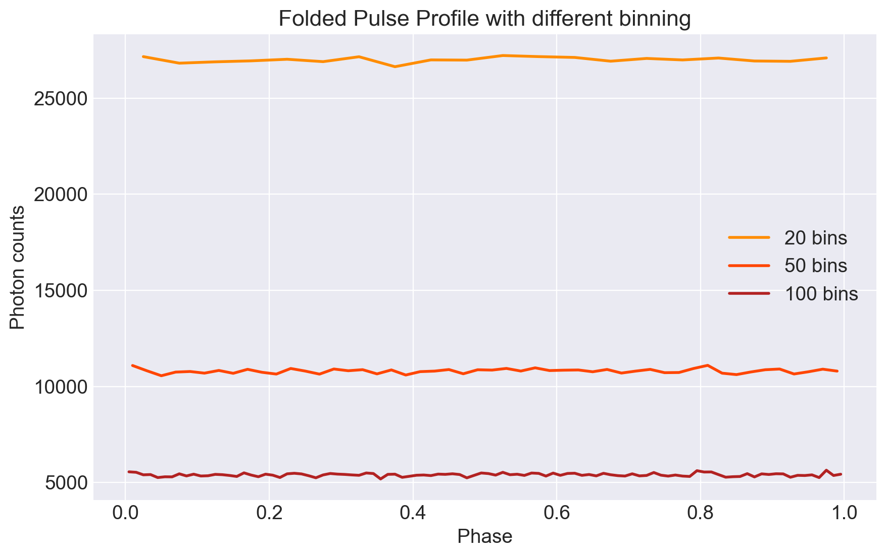
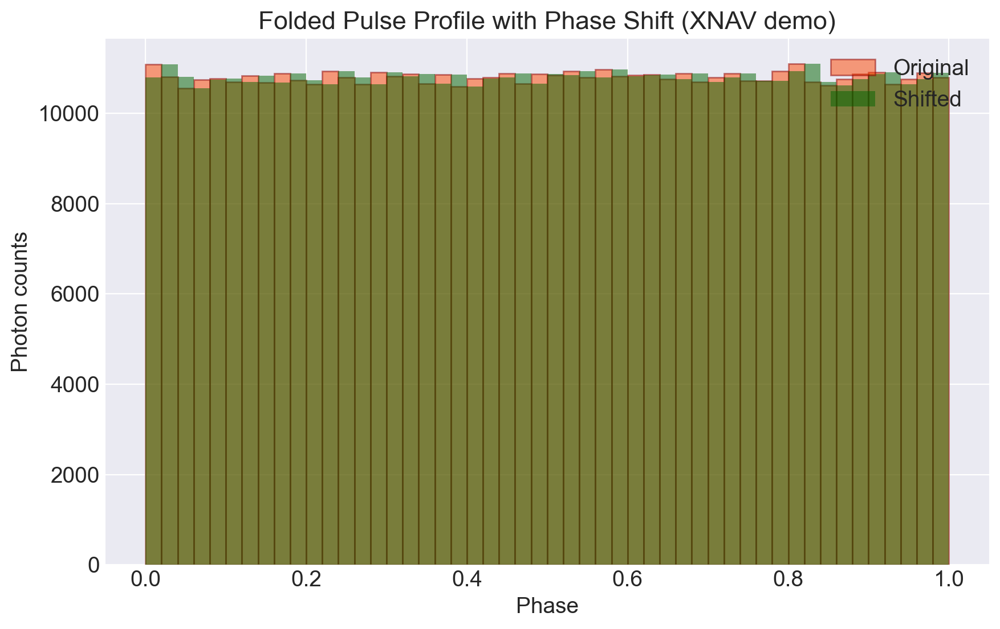

# Vela Pulsar Analysis for XNAV Demonstration

Author: Victoria Kupina  
Role: Data Analyst / Junior Data Scientist

## Problem Statement

Pulsars are rapidly rotating neutron stars that emit highly periodic signals.

This project demonstrates how photon arrival-time data from the Vela pulsar can be analyzed to detect a dominant pulsation period, build a folded pulse profile, and illustrate the basic timing logic behind X-ray pulsar navigation.

## Objectives

- Load and inspect photon event data.
- Explore photon arrival times and energy distribution.
- Preprocess the dataset and filter low-energy events.
- Detect the dominant pulsation period.
- Build folded pulse profiles.
- Demonstrate how phase shifts can be interpreted as timing errors in an XNAV-style example.

## Project Structure

- `data/README.md` — local data setup instructions.
- `notebooks/01_data_loading.ipynb` — data loading and initial inspection.
- `notebooks/02_exploratory_analysis.ipynb` — exploratory analysis.
- `notebooks/03_preprocessing.ipynb` — data preprocessing.
- `notebooks/04_period_detection.ipynb` — period detection.
- `notebooks/05_epoch_folding.ipynb` — folded pulse profile.
- `notebooks/06_xnav_demo.ipynb` — simplified XNAV demonstration.
- `requirements.txt` — Python dependencies.
- `LICENSE` — MIT license.

## Data

Raw FITS data is not included in this repository because large data files are ignored by Git.

To run the notebooks, place the photon event file at:

`data/raw/vela_photons.fits`

Additional details are provided in `data/README.md`.

## Methods

- Photon arrival-time analysis
- Exploratory data analysis
- Signal preprocessing
- Lomb-Scargle period detection
- Epoch folding
- Pulse profile visualization
- Simplified XNAV timing demonstration

## Notebooks

| Notebook | Description |
|---|---|
| `01_data_loading.ipynb` | Load FITS photon event data and inspect the dataset |
| `02_exploratory_analysis.ipynb` | Explore photon arrival times, energy distribution and inter-arrival times |
| `03_preprocessing.ipynb` | Convert FITS data to a clean tabular format, create relative time values and apply energy filtering |
| `04_period_detection.ipynb` | Detect the dominant pulsation period using epoch folding |
| `05_epoch_folding.ipynb` | Build a folded pulse profile using the detected pulsation period |
| `06_xnav_demo.ipynb` | Demonstrate phase shifts, timing errors and simplified XNAV logic |

## Results

The project produces the following visual outputs:

- `notebooks/images/04_period_detection.png` — epoch-folding period search result;
- `notebooks/images/05_folded_pulse_profile.png` — folded pulse profile;
- `notebooks/images/06_xnav_phase_shift_demo.png` — simulated XNAV phase shift demonstration;
- `notebooks/images/06_phase_shift_to_range_error.png` — phase shift to approximate range error relationship.

## Limitations

This project uses a simplified educational workflow.

It does not include:

- barycentric corrections;
- relativistic corrections;
- full spacecraft orbit determination;
- uncertainty estimation;
- multi-pulsar navigation;
- sensor fusion.

The XNAV section should be interpreted as a conceptual demonstration rather than a real navigation system.
Key result:

`Dominant period ≈ 0.0893 s`

## Visual Results

### Folded Pulse Profile

### XNAV Phase Shift Demonstration

## Tech Stack

- Python
- NumPy
- Pandas
- Matplotlib
- SciPy
- Astropy
- psrqpy
- Jupyter Notebook

## How to Run

Clone the repository:

`git clone https://github.com/kva99kva-eng/pulsar.git`

Go to the project folder:

`cd pulsar`

Create and activate a virtual environment:

`python -m venv .venv`

`.venv\Scripts\activate`

Install dependencies:

`pip install -r requirements.txt`

Place the FITS file here:

`data/raw/vela_photons.fits`

Run Jupyter Lab:

`jupyter lab`

Then run the notebooks in order from `01` to `06`.

## Limitations

This is a learning-oriented project. It does not include full spacecraft dynamics, relativistic corrections, onboard sensor fusion, or a production-grade navigation filter.

## License

This project is licensed under the MIT License.
