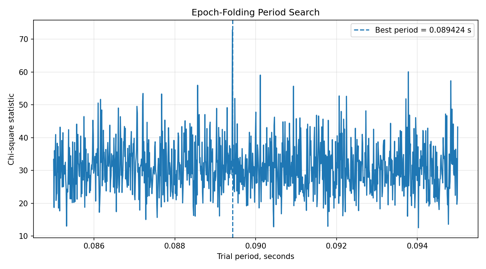
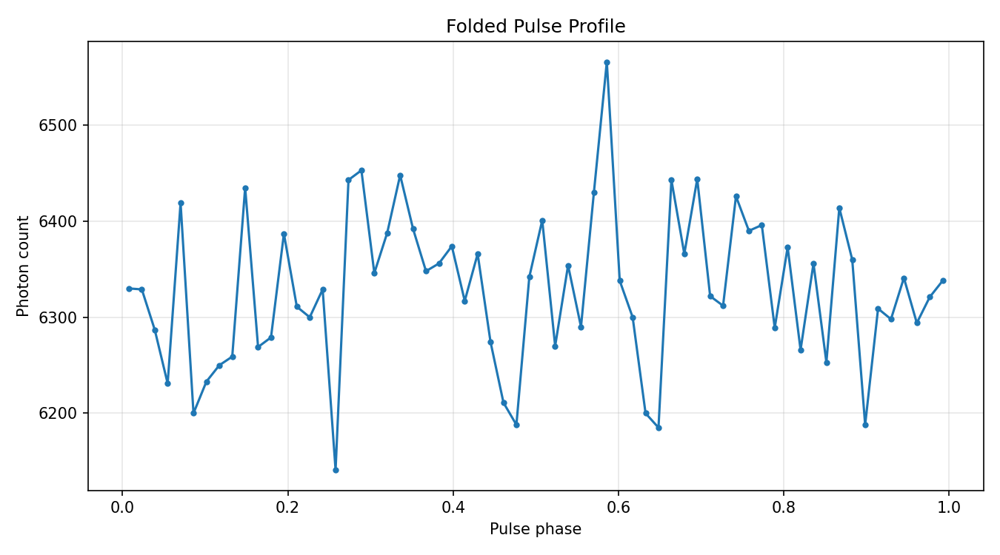
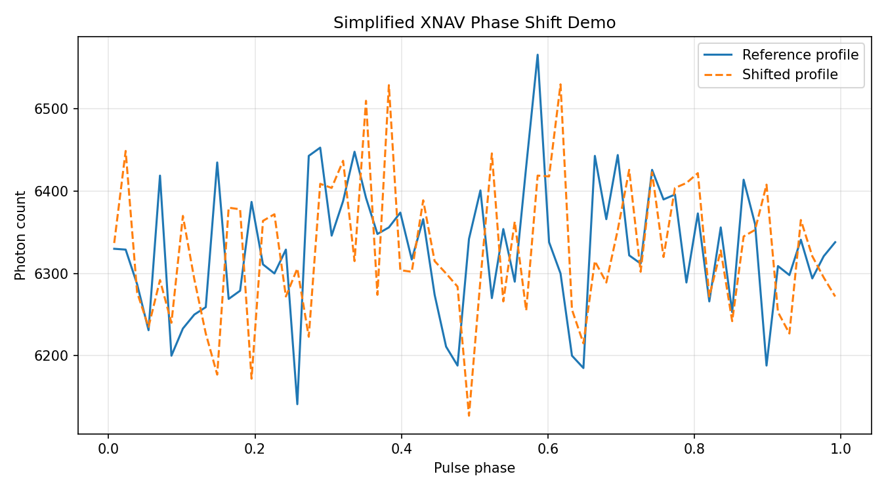
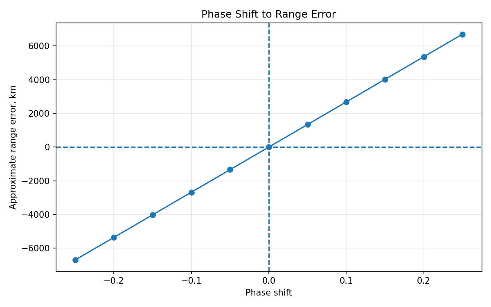

# Vela Pulsar Timing & Simplified XNAV Demonstration

**Research-style signal analysis project using Vela pulsar photon event data**

Author: Victoria Kupina  
Role: Research / Data Analyst — Signal Processing & Systems Analysis  

## Executive summary

This project demonstrates how photon arrival-time data from the Vela pulsar can be analyzed to detect periodic structure, build a folded pulse profile and illustrate the basic timing logic behind X-ray pulsar navigation (XNAV).

The goal is not to claim a production-grade navigation system. The goal is to show a reproducible analytical workflow for working with noisy observational data where the measured signal is an indirect projection of a physical process.

This project is positioned at the intersection of:

- time-series analysis;
- signal processing;
- astrophysical data analysis;
- systems thinking;
- reproducible research workflows.

---

## Problem statement

Pulsars are rapidly rotating neutron stars that emit highly periodic signals. Because of their stable timing behavior, pulsars are often discussed in the context of high-precision timing and X-ray pulsar navigation concepts.

In real observational data, the signal is not presented as a clean periodic curve. It must be reconstructed from photon arrival events under noise, sampling limitations and preprocessing assumptions.

This project asks:

> Can a dominant periodic structure be extracted from photon event data and transformed into an interpretable folded pulse profile?

---

## Research questions

1. How can photon event data be transformed into a clean analytical format?
2. Can periodic structure be detected from arrival-time observations?
3. How does epoch folding help reconstruct a pulse profile?
4. How can phase shifts be interpreted as timing errors in a simplified XNAV-style demonstration?
5. What are the limitations of this simplified workflow compared with a real navigation-grade system?

---

## Analytical workflow

The project follows a structured research pipeline:

1. **Data loading**
   - read FITS photon event data;
   - inspect available columns and event structure.

2. **Exploratory analysis**
   - analyze photon arrival times;
   - inspect energy distribution;
   - examine inter-arrival behavior.

3. **Preprocessing**
   - convert event data into a clean tabular format;
   - create relative time values;
   - apply energy-based filtering.

4. **Period detection**
   - search for the dominant pulsation period using an epoch-folding approach;
   - evaluate the strongest candidate period.

5. **Epoch folding**
   - fold photon events by phase;
   - construct a phase-aligned pulse profile.

6. **Simplified XNAV demonstration**
   - simulate phase shifts;
   - convert phase shift into timing error;
   - illustrate the relationship between timing error and approximate range error.

---

## Project structure

```text
pulsar/
├── data/
│   └── README.md
├── notebooks/
│   ├── 01_data_loading.ipynb
│   ├── 02_exploratory_analysis.ipynb
│   ├── 03_preprocessing.ipynb
│   ├── 04_period_detection.ipynb
│   ├── 05_epoch_folding.ipynb
│   ├── 06_xnav_demo.ipynb
│   └── images/
├── requirements.txt
├── LICENSE
└── README.md
```

---

## Notebooks

| Notebook | Purpose |
|---|---|
| `01_data_loading.ipynb` | Load FITS photon event data and inspect the dataset |
| `02_exploratory_analysis.ipynb` | Explore photon arrival times, energy distribution and inter-arrival times |
| `03_preprocessing.ipynb` | Convert FITS data into a clean tabular format and apply filtering |
| `04_period_detection.ipynb` | Detect the dominant pulsation period using epoch folding |
| `05_epoch_folding.ipynb` | Build a folded pulse profile using the detected period |
| `06_xnav_demo.ipynb` | Demonstrate phase shift, timing error and simplified XNAV logic |

---

## Methods

- FITS data loading and inspection;
- photon arrival-time analysis;
- exploratory data analysis;
- signal preprocessing;
- epoch-folding period detection;
- pulse profile reconstruction;
- phase-shift simulation;
- simplified timing-to-range interpretation.

---

## Key result

The workflow detects a dominant pulsation period close to the expected Vela pulsar timing scale:

```text
Dominant period ≈ 0.0893 s
```

The project also produces visual outputs for:

- period detection;
- folded pulse profile;
- simulated XNAV phase shift;
- approximate phase-shift-to-range-error relationship.

---

## Visual Results

The project produces several visual artifacts that summarize the main analytical steps: period detection, pulse-profile reconstruction and simplified XNAV timing interpretation.

### 1. Period detection

The epoch-folding search identifies the strongest candidate pulsation period in the photon arrival-time data.



---

### 2. Folded pulse profile

Photon events are folded by phase using the detected period to reconstruct the pulsar pulse profile.



---

### 3. XNAV phase-shift demonstration

A simplified XNAV-style example showing how a phase shift can be interpreted as a timing offset.



---

### 4. Phase shift to range error

A conceptual visualization of how timing error can be translated into approximate range error.


---

## Why this project is relevant

This project demonstrates skills that are useful for research, BI/data and systems-oriented roles in technical companies.

### Research Analyst / Space Technology Research

- ability to work with unfamiliar technical domains;
- understanding of scientific / engineering context;
- structured decomposition of a physical-data problem;
- clear documentation of assumptions and limitations.

### BI / Data Platform Analyst

- reproducible analytical pipeline;
- clean transformation from raw data to interpretable outputs;
- data quality awareness;
- structured notebook-based reporting.

### Systems Engineering / Systems Analyst

- translation of raw observations into system-level interpretation;
- phase-shift and timing-error reasoning;
- explicit limitations and boundary conditions;
- decomposition of a complex technical idea into steps, artifacts and outputs.

---

## Limitations

This is a simplified research and demonstration project. It does not include:

- barycentric corrections;
- relativistic corrections;
- full spacecraft orbit determination;
- uncertainty estimation;
- multi-pulsar navigation;
- sensor fusion;
- production-grade validation.

The XNAV section should be interpreted as a conceptual timing demonstration, not as a real navigation system.

The value of the project is in the analytical structure: how raw observational data is transformed into a reproducible sequence of technical artifacts.

---

## Tech stack

- Python
- NumPy
- pandas
- Matplotlib
- SciPy
- Astropy
- psrqpy
- Jupyter Notebook

---

## Data

Raw FITS data is not included in this repository because large data files are ignored by Git.

To run the notebooks, place the photon event file at:

```text
data/raw/vela_photons.fits
```

Additional details are provided in:

```text
data/README.md
```

---

## How to run

Clone the repository:

```bash
git clone https://github.com/kva99kva-eng/pulsar.git
```

Go to the project folder:

```bash
cd pulsar
```

Create and activate a virtual environment:

```bash
python -m venv .venv
.venv\Scripts\activate
```

Install dependencies:

```bash
pip install -r requirements.txt
```

Place the FITS file here:

```text
data/raw/vela_photons.fits
```

Run Jupyter Lab:

```bash
jupyter lab
```

Then run the notebooks in order from `01` to `06`.

---

## Future improvements

To make the project closer to a production-grade research workflow, the next improvements would be:

- add uncertainty estimation for the detected period;
- compare epoch-folding results with another period-search method;
- move reusable logic from notebooks into `src/`;
- add tests for preprocessing and phase calculations;
- add a project-level configuration file;
- document assumptions and parameters in a separate technical note;
- add a short architecture diagram for the analysis pipeline.

---

## License

This project is licensed under the MIT License.
